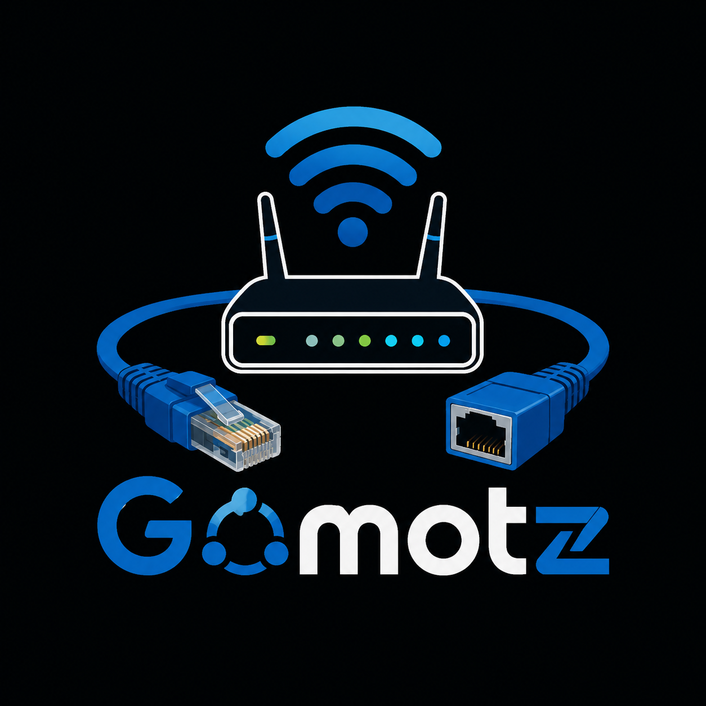
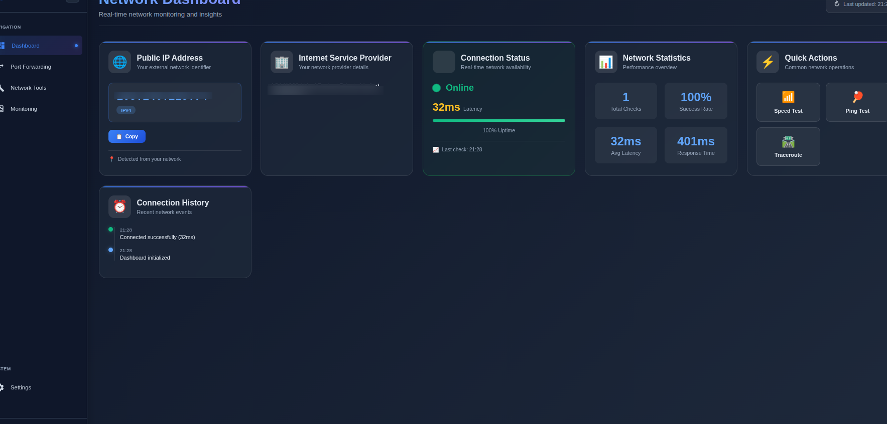
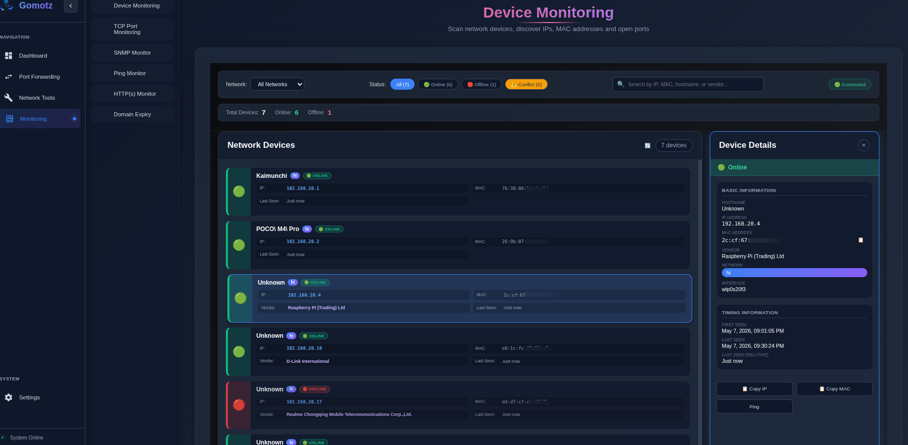
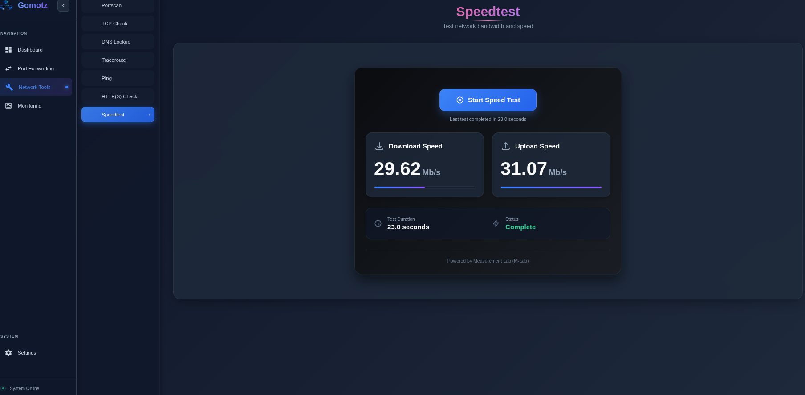
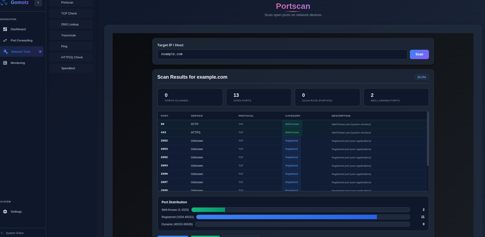

<p align="center">
  
</p>

<div align="center">


# GoMotz

### Open-Source Network Monitoring

**Self-hosted, Simple Network Monitoring System built for Raspberry Pi.**

*Monitor, control, and secure your entire network from a single dashboard.*

---

</div>

## What is GoMotz?

**GoMotz** is a free, open-source network monitoring and management system designed to run on a **Raspberry Pi**. It gives you full visibility and control over your local network from device discovery to port forwarding, DNS lookups to service checks all from an elegant real-time web dashboard.

Whether you're a homelab enthusiast or network engineer GoMotz puts network monitoring in your hands, **for free**.

---
<p align="center">
 
  
  
  
</p>

## Architecture

GoMotz follows a lightweight, modular architecture optimized to run efficiently on Raspberry Pi hardware.

```
┌─────────────────────────────────────────────────────────────┐
│                        GoMotz Agent                         │
│                    (Raspberry Pi Device)                    │
│                                                             │
│  ┌─────────────┐  ┌─────────────┐  ┌────────────────────┐  │
│  │   Network   │  │   Service   │  │   Port Forwarding  │  │
│  │  Discovery  │  │  Monitors   │  │  & Tailscale Bind  │  │
│  └──────┬──────┘  └──────┬──────┘  └─────────┬──────────┘  │
│         │                │                   │             │
│  ┌──────▼────────────────▼───────────────────▼──────────┐  │
│  │                    Core Engine                       │  │
│  │         (SNMP · ARP · ICMP · TCP · HTTP)             │  │
│  └──────────────────────────┬───────────────────────────┘  │
│                             │                              │
│  ┌──────────────────────────▼───────────────────────────┐  │
│  │                 REST API / WebSocket                 │  │
│  └──────────────────────────┬───────────────────────────┘  │
└─────────────────────────────│──────────────────────────────┘
                              │
              ┌───────────────▼────────────────┐
              │          Web Dashboard         │
              │  (Real-time UI · Any Browser)  │
              └────────────────────────────────┘
```

**Key design principles:**
- **Self-contained** — Everything runs on the Pi no cloud dependency
- **Real-time** — WebSocket-driven live updates across all dashboard panels
- **Lightweight** — Designed to run efficiently on Raspberry Pi 4 (2GB+)

---

## Features

### Network Dashboard
Real-time overview of your entire network at a glance.

- **Public IP Detection** — Instantly see your external IP address with one-click copy
- **ISP Information** — Identify your Internet Service Provider and ASN details
- **Connection Status** — Live uptime tracking with percentage metrics
- **Network Statistics** — Total checks, success rate, average latency, and response time
- **Connection History** — Timestamped log of recent network events

---

### Device Monitoring
Scan and track every device on your network.

- **Network Device Discovery** — Automatically detect all connected devices
- **IP & MAC Address Tracking** — Full inventory with hostname and vendor info
- **Status Filtering** — View Online, Offline, and Conflict devices instantly
- **Open Port Discovery** — See which ports are active on each device
- **Search & Filter** — Find any device by IP, MAC, hostname, or vendor name
- **Domain Expiry Monitor** — Stay ahead of expiring domain registrations

---

### Port Forwarding & Service Exposure

Expose your internal services for remote access using port forwarding with Tailscale.

> ⚠️ **Note:** GoMotz does not yet include a built-in reverse proxy. Remote access is currently handled through **Tailscale**. To access your LAN services remotely, install Tailscale on your Raspberry Pi and connect your devices to the same Tailscale network.

When adding a port forwarding rule, the **local IP** can be set in one of two ways:
- **Tailscale IP** (e.g. `100.x.x.x`) — to bind the rule specifically to your Tailscale interface, making it accessible only over your Tailscale network
- **`0.0.0.0`** — to bind to all interfaces, making it accessible from both your local network and Tailscale

This gives you flexible, secure control over which services are exposed and how they are reached remotely.

**Features:**
- **Port Forwarding Rules** — Translate internal IP:Port combinations to custom external ports
- **Tailscale Interface Binding** — Bind rules to your Tailscale IP for secure, private remote access
- **Multiple Device IP/Port Mapping** — Manage complex multi-service environments with ease
- **Real-Time Service Monitoring** — Track the live status of all forwarded services

---

### Network Tools
A full suite of diagnostic utilities built right in.

| Tool | Description |
|------|-------------|
| **Port Scan** | Scan any host for open TCP ports |
| **TCP Check** | Verify TCP connectivity to any IP and port |
| **DNS Lookup** | Resolve domains with support for all record types (A, AAAA, MX, CNAME, TXT, SOA, NS, SRV, PTR, and more) |
| **Traceroute** | Visualize the network path to any destination |
| **Ping Monitor** | Continuous latency monitoring for any host |
| **HTTP(S) Check** | Validate HTTP/HTTPS endpoint availability and response |
| **Speed Test** | Measure your real-time internet bandwidth |

---

### Service Monitoring
Keep tabs on all your critical services.

- **TCP Port Monitoring** — Persistent monitoring of any TCP service
- **HTTP(S) Monitor** — Uptime tracking with SSL certificate monitoring
- **Ping Monitor** — ICMP-based reachability monitoring
- **SNMP Monitor** — Poll network devices using SNMP for deep hardware metrics
- **Add/Remove Services** — Simple UI to manage your entire monitoring setup

---

## Roadmap

📄 **[View the full Roadmap →](docs/ROADMAP.md)**

---

## Getting Started

> ⚠️ **GoMotz is currently in BETA.**

**Requirements:**
- Raspberry Pi 4 (2GB RAM or more recommended) or any Linux-based device
- Raspberry Pi OS (64-bit) or compatible Debian-based distribution
- Docker

```bash
git clone https://github.com/mascarenhasmelson/gomotz.git
cd gomotz
docker-compose up -d
```

📖 For detailed setup including VLAN configuration, network interface setup, and first-run walkthrough:

**[Read the Setup Guide →](docs/SETUP.md)**

---

## Contributing

GoMotz is open source and contributions are welcome! Whether it's bug reports, feature suggestions, documentation, or code — all help is appreciated.

---

## License

GoMotz is released under the [MIT License](LICENSE).

---

## Motivation

Honestly, this started out of frustration.

**Domotz** is a powerful monitoring solution both in software and hardware  but it comes at a relatively high cost, especially for personal or small-scale use. On top of that, I found myself juggling **multiple dashboards and tools**, mentally mapping ports, switching between browser tabs, and losing track of what was running where.

So I built GoMotz. Since backend developed in Go hence named it as Gomotz 

A single, self-hosted platform that gives me and now you **full visibility and control over your network**, without the subscription, without the fragmentation, and without the frustration. Everything in one place, running on hardware you already own.

<div align="center">

If you love this project, please consider giving it a ⭐

</div>